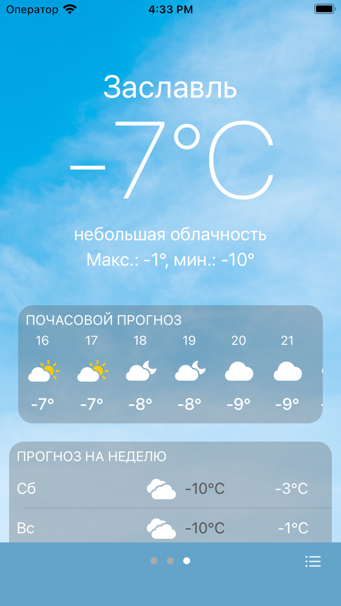
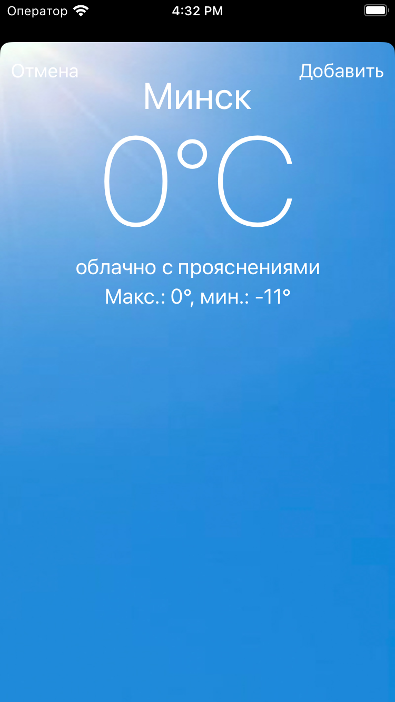

<!-- PROJECT LOGO -->
 

<!-- TABLE OF CONTENTS -->

  
Table of Contents

  <ol>
    <li>
      <a href="#about-the-project">About The Project</a>
      <ul>
        <li><a href="#built-with">Built With</a></li>
      </ul>
    </li>
    <li><a href="#contact">Contact</a></li>
  </ol>

## About The Project

| Main Screen | Location Screen | Search Screen | Preview Weather Screen |
| --- | --- | --- | --- |
|  |  |  |  |

 

An iOS app that visually clones native Weather app and uses OpenWeather API to get weather info and iOS CoreLocation for gps data. It was made as test project.

(<a href="#readme-top">back to top</a>)

## Built With

This app was build using MVVM-C architecture. Frameworks were integrated with Swift Package Manger. I've used Observer and Delegate paterns.

 
<ul>
    <li>UIKit</li>
  <li>CoreLocation</li>
  <li>Hero</li>
    <li>Alamofire</li>
    <li>Dependency Injection</li>
    <li>XCode Instruments</li>
</ul>

Alamofire was used for getting and parsing data from OpenWeather API. CoreLocation was used for getting gps data for passing in to OpenWeather API.
Hero was used for animated screen transitions

## Contact
My [LinkedIn](https://www.linkedin.com/in/nicktsaruk/)
